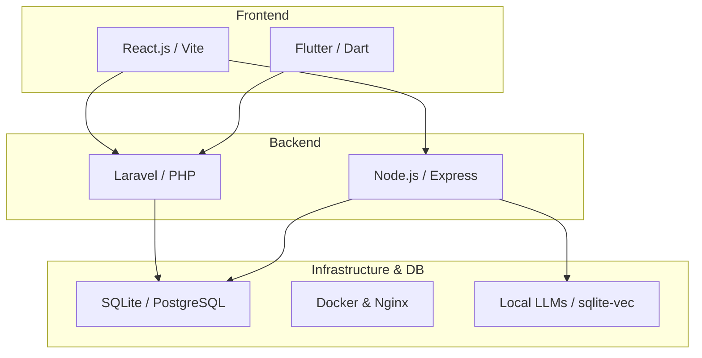

# Digital Chokro
**Premium IT Agency | Enterprise Web & Mobile Solutions | AI Integrations**

We are a forward-thinking IT agency specializing in engineering robust digital products, custom internal tooling, and scalable full-stack applications for businesses worldwide. We bridge the gap between creative marketing strategy and cutting-edge software engineering.

---

## What We Build

At Digital Chokro, we develop tailored software solutions designed for high performance and reliability. 

- **Enterprise SaaS Applications:** End-to-end architectures utilizing Laravel and React.
- **Cross-Platform Mobile Apps:** High-fidelity applications built with Flutter.
- **Local AI & Automation:** Integrating privacy-first local language models (Ollama) into agency workflows and client products.
- **Business Management Tools:** Custom Inventory, CRM, and HR systems (e.g., Ishan CRM, Insaf Inventory).

## Our Technology Ecosystem

## Open Source Commitment
While our core client work remains proprietary, Digital Chokro is committed to giving back to the developer community. We actively develop and release foundational tooling, framework boilerplates, and UI components to help other agencies build better software faster.

---
**Contact & Business Inquiries:** [Visit our Website](https://digitalchokro.com)
